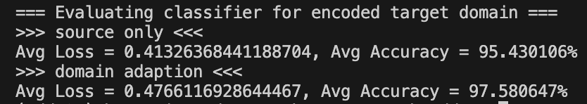

# PyTorch-ADDA-repair
A repair version for https://github.com/corenel/pytorch-adda

Repair include:
1. Achieve a similar performance of domain adaptation from MNIST (Source)
to USPS (target) around 97.63% by removing line #61 at ./dataset/usps.py
2. Fix some outdated functions to make them compatible with PyTorch 1.x.

## Environment
- Python 3.8
- PyTorch 1.9.0


## Usage

```shell
python3 main.py
```

## Result

|                                    | MNIST (Source) | USPS (Target) |
| :--------------------------------: | :------------: | :-----------: |
| Source Encoder + Source Classifier |   99.210000%   |  95.430106%   |
| Target Encoder + Source Classifier |                |  97.580647%   |

Domain Adaptation does work (97% vs 95%). 

(95% is high but is indeed the output, as follow)


